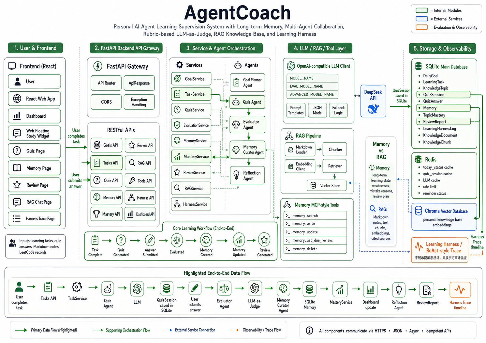
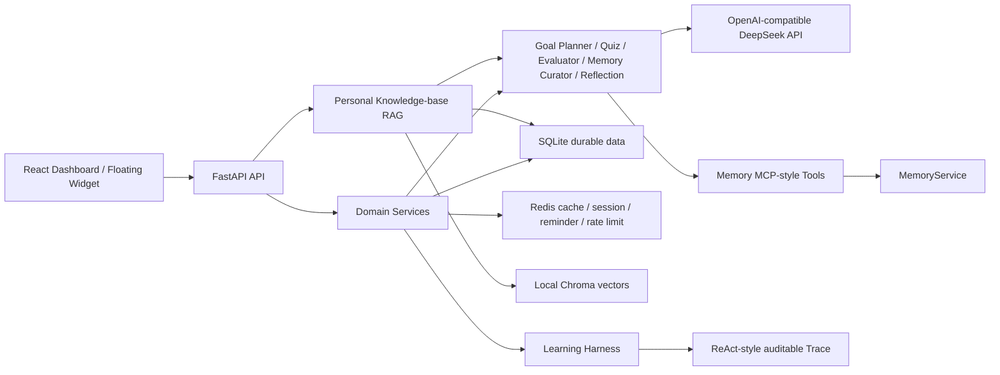

# AgentCoach

AgentCoach 是一个基于长期记忆、Memory MCP、个人知识库 RAG 和多智能体协作的个人 AI Agent 学习监督与复盘系统。它围绕每日目标、Web 悬浮提醒、手动打卡、知识检测、Rubric 评分、长期 Memory、掌握度、复盘、Redis、Learning Harness 和可审计 Trace 构建完整学习闭环。

## 系统架构




## 项目边界：不是 Code Agent

AgentCoach **不是 Code Agent**：

- 不自动写代码或修改 GitHub 仓库。
- 不自动运行、提交或代做 LeetCode。
- LeetCode 模块只记录用户手动完成情况、错因、收获和复习时间。
- 不展示或保存模型隐藏思维链。
- 不提供 Shell、任意文件读取或通用系统操作工具。

## 核心学习闭环

1. Goal Planner 根据到期 Memory 和掌握度生成今日目标。
2. Dashboard 和右下角 Web Floating Study Widget 展示任务。
3. 用户手动完成或跳过任务。
4. Agent 知识任务完成后，Quiz Agent 生成 3～5 个问题。
5. 用户提交全部回答。
6. Evaluator Agent 按 Rubric 评分并给出可审计反馈。
7. Memory Curator 提取长期有价值的薄弱点和复习建议。
8. Mastery Service 更新知识掌握度和下次复习时间。
9. Reflection Agent 生成每日复盘。
10. Learning Harness 记录完整流程，Memory 影响后续学习计划。

## 技术架构



技术栈：

- 后端：FastAPI、Pydantic、SQLAlchemy、SQLite、python-dotenv。
- LLM：OpenAI-compatible SDK，默认 DeepSeek API。
- 缓存：Redis，可选且支持故障回退。
- 前端：React、Vite、TypeScript、TailwindCSS、React Router。
- MCP：项目内部固定 Tool Registry，后续可迁移正式 MCP SDK。
- RAG：Markdown Loader、标题感知 Chunking、sentence-transformers、Chroma PersistentClient。

## 功能模块

- 每日目标与学习任务 CRUD。
- Goal Planner 自动生成今日学习计划。
- Agent 知识主题与掌握度展示。
- LeetCode 手动学习记录。
- Quiz Session、回答保存和恢复。
- Rubric-based LLM-as-Judge。
- 长期 Memory 管理、去重、合并和复习时间。
- 每日 Reflection 报告。
- Redis 缓存、提醒状态与 LLM 限流。
- Learning Harness 与 Trace 页面。
- Memory MCP-style Tools 页面。
- Markdown 笔记、Chunk 预览、向量检索、来源引用问答和知识库 Quiz。

## Agent 角色

| Agent | 职责 | 失败回退 |
| --- | --- | --- |
| Goal Planner | 基于 Memory MCP 和 Mastery 生成今日计划 | 确定性学习计划 |
| Quiz Agent | 根据知识内容和关键点生成检测问题 | 预设问题 |
| Evaluator Agent | 按 40/30/20/10 Rubric 评分 | Rule-based evaluator |
| Memory Curator | 提取、合并薄弱点、错因和收获 | 使用结构化评估结果 |
| Reflection Agent | 汇总任务、Quiz、Memory、LeetCode、Mastery | 模板复盘 |

Agent 层只负责模型推理和结构化输出，不直接写数据库。数据库事务、缓存刷新和业务规则位于 Service 层，Prompt 单独存放在 `backend/app/prompts/`。

## Memory 设计

长期 Memory 不保存全部聊天记录，只保存对后续学习有价值的信息：

- `goal_memory`
- `completion_memory`
- `weakness_memory`
- `mistake_memory`
- `insight_memory`
- `review_memory`

每条 Memory 包含 topic、内容、来源、importance、confidence、tags 和 `next_review_at`。Memory Service 支持检索、创建、更新、删除、相似内容合并和到期复习查询。

Mastery 计算：

```text
mastery_score =
0.3 * completion_rate
+ 0.4 * quiz_average_score
+ 0.2 * review_score
+ 0.1 * self_summary_score
```

缺失信号使用中性默认值，避免因为暂无复习数据而错误归零。

## RAG 个人 Agent 知识库

RAG 保存“用户提供的学习资料”，Memory 保存“用户长期学习状态”：

| 对比项 | RAG | Memory |
| --- | --- | --- |
| 内容 | Markdown 笔记、知识材料、原文 Chunk | 薄弱点、错因、收获、复习计划 |
| 存储 | SQLite 文档/Chunk + Chroma 向量 | SQLite Memory 表 |
| 检索 | Embedding 相似度检索 | 文本、topic、类型、到期时间 |
| 生命周期 | 用户编辑或删除文档时重新索引 | Curator 去重、合并和安排复习 |
| 作用 | 为问答和 Quiz 提供可引用依据 | 调整目标、掌握度和复习计划 |

笔记不会被整体写入 Memory。只有基于知识库 Quiz 评估得到的用户薄弱点，才复用原有 Evaluator→Memory Curator→Mastery 链路。

RAG 流程：

```text
Markdown/Text
  → 标题解析与规范化
  → 300-700 字符 Chunk（100 字符 overlap）
  → 本地或 OpenAI-compatible Embedding
  → Chroma cosine vector index
  → top-k Retriever
  → 来源约束 Prompt
  → answer + [n] citations + source chunks
```

Chunk metadata 保存 `document_id`、`title`、`heading` 和 `chunk_index`。当前 Retriever 预留了后续 Rerank 边界，但未引入复杂知识图谱。

Chroma 使用本地持久化模式，不需要单独启动服务。默认路径：

```text
backend/chroma_data
```

默认本地 Embedding：

```text
sentence-transformers/paraphrase-multilingual-MiniLM-L12-v2
```

模型权重在第一次索引时加载。也可以将 `EMBEDDING_PROVIDER` 设置为 `openai-compatible`，并配置支持 Embedding API 的 Base URL 和模型名。

问答安全规则：

- 只允许依据检索 Chunk 回答。
- 回答必须包含 `[1]`、`[2]` 等来源引用。
- 没有检索结果或相似度不足时返回“知识库中没有足够依据”。
- 模型调用失败时使用检索原文的引用式 fallback，不使用外部知识补答。
- 前端始终展示 sources 和 retrieved chunks。

使用方式：

1. 打开 `/knowledge-base`，直接编写 Markdown，或选择本机 `.md` 文件后点击“上传并创建”。
2. 进入文档详情检查内容，点击“向量化”，并确认 Chunk 预览。
3. 打开 `/rag-chat` 输入问题，检查回答中的 `[n]` 引用、来源卡片和检索 Chunk。
4. 在同一页面选择文档并生成 Quiz，完成回答后继续使用原有 Evaluator、Memory 和 Mastery 流程。

## Redis 的作用

Redis 不是长期主数据库，SQLite 始终是事实源。

| Key | 用途 | TTL |
| --- | --- | --- |
| `today_status:{user_id}:{date}` | Dashboard 今日状态 | 5 分钟 |
| `quiz_session:{session_id}` | Quiz 会话恢复 | 1 小时 |
| `llm_cache:quiz:{topic}:{difficulty}` | Quiz 生成缓存 | 24 小时 |
| `llm_cache:evaluation:{hash}` | 相同问答评分缓存 | 10 分钟 |
| `rate_limit:user:{user_id}:llm` | 每分钟 10 次 LLM 调用 | 60 秒 |
| `reminder_status:{user_id}:{date}` | 提醒与待检测状态 | 24 小时 |

Redis 不可用时：

- Dashboard、Quiz 和提醒状态回退 SQLite。
- LLM 限流 fail-open，避免缓存故障阻断学习。
- Memory、Quiz 历史和复盘不会丢失。

## Learning Harness

`LearningHarnessLog` 记录：

- `event_type`
- 关联实体类型与 ID
- 脱敏后的输入/输出 Payload
- 状态、耗时和时间

关键事件包括 `goal_planned`、`task_completed`、`quiz_generated`、`answer_submitted`、`answer_evaluated`、`memory_created`、`mastery_updated`、`review_scheduled`、`review_generated`、`reminder_triggered`、`tool_called`、`document_created`、`document_indexed`、`rag_searched`、`rag_answered` 和 `rag_quiz_generated`。

Harness 使用独立数据库会话并捕获自身异常，因此日志失败不会回滚或阻断主学习流程。

## ReAct-style Trace

Trace 页面展示可审计流程，不展示模型隐藏思维链：

1. 识别完成任务。
2. 生成检测问题。
3. 接收用户回答。
4. 评分与反馈。
5. 写入 Memory。
6. 更新掌握度。
7. 安排复习。

Payload 默认折叠，长字符串由后端截断，展开区域限制高度。

## Memory MCP Server

当前是项目内部 MCP-style Memory Server，不是复杂 MCP 平台。固定工具：

| Tool | 功能 |
| --- | --- |
| `memory.search` | 文本、topic、memory type 检索 |
| `memory.write` | 创建长期记忆 |
| `memory.update` | 更新允许字段 |
| `memory.list_due_reviews` | 查询到期复习记忆 |
| `memory.delete` | 删除不准确记忆 |

Tool Registry 不支持客户端动态注册，不执行动态导入。所有 handler 只调用现有 MemoryService，成功和失败均写入 Harness。Memory MCP 不持有 LLM API Key。

## 为什么不做 Prompt Engineering MCP

Prompt Engineering 是 AgentCoach 的学习主题，不是本项目需要暴露的系统资源。建设 Prompt MCP 或 Prompt Library 会扩大权限和维护范围，偏离“学习监督与长期记忆”的核心目标。当前 Prompt 仅作为后端版本化模板，由对应 Agent 使用。

## DeepSeek 模型配置

所有模型选择通过 Settings 从环境变量读取；Agent 和 Service 不硬编码模型名或 API Key。

- `MODEL_NAME`：Goal Planner、Quiz、Memory Curator、Reflection。
- `EVAL_MODEL_NAME`：Evaluator。
- `ADVANCED_MODEL_NAME`：复杂任务预留，当前默认流程不使用。

项目不使用旧版 Chat/Reasoner 模型标识，运行模型完全由上述环境变量控制。

## 安全边界

- API Key 只从 `.env` 读取，不写入数据库、Harness 或 MCP Server。
- Harness 自动脱敏 API Key、Token、Authorization、密码、系统 Prompt 和环境变量。
- 不暴露隐藏思维链、完整系统 Prompt 或敏感环境配置。
- Memory MCP 不能执行 Shell、读取任意文件或访问任意系统资源。
- RAG 只处理用户主动创建或在浏览器本地选择的 Markdown/Text 内容。
- Chroma 默认只写入本机持久化目录，不强制使用外部云向量数据库。
- 用户必须手动确认任务完成和 LeetCode 结果。
- 当前是单用户 MVP，使用 `user_id=default`；远程部署前必须加入认证和租户隔离。

## 环境要求

- Python 3.10+
- Node.js 20+
- npm 10+
- Redis 7，可选

## 安装

后端：

```powershell
cd backend
py -3.10 -m venv .venv
.\.venv\Scripts\Activate.ps1
python -m pip install -r requirements.txt
Copy-Item .env.example .env
```

前端：

```powershell
cd frontend
npm install
```

可选 Redis：

```powershell
docker run --name agentcoach-redis -p 6379:6379 -d redis:7-alpine
```

## `.env` 配置

`backend/.env.example`：

```dotenv
OPENAI_API_KEY=your_deepseek_api_key
OPENAI_BASE_URL=https://api.deepseek.com
MODEL_NAME=deepseek-v4-flash
EVAL_MODEL_NAME=deepseek-v4-flash
ADVANCED_MODEL_NAME=deepseek-v4-pro
DATABASE_URL=sqlite:///./agentcoach.db
REDIS_URL=redis://localhost:6379/0
EMBEDDING_PROVIDER=local
EMBEDDING_MODEL_NAME=sentence-transformers/paraphrase-multilingual-MiniLM-L12-v2
OPENAI_EMBEDDING_MODEL_NAME=text-embedding-3-small
CHROMA_PERSIST_DIR=./chroma_data
RAG_MIN_SIMILARITY=0.25
```

没有 API Key 时，Goal Planner、Quiz、Evaluator、Memory Curator 和 Reflection 使用各自 fallback，项目仍可演示完整学习闭环。

## 启动后端

```powershell
cd backend
.\.venv\Scripts\Activate.ps1
python -m uvicorn app.main:app --reload
```

- API：http://127.0.0.1:8000
- Swagger：http://127.0.0.1:8000/docs
- 健康检查：http://127.0.0.1:8000/api/health

启动时通过 `Base.metadata.create_all()` 自动创建 SQLite 表。生产环境建议引入 Alembic。

## 启动前端

```powershell
cd frontend
npm run dev
```

访问：http://127.0.0.1:5173

主要路由：

- `/`：Dashboard
- `/knowledge`：知识主题
- `/quiz/:sessionId`：Quiz 与评分
- `/memory`：长期 Memory
- `/review`：每日复盘
- `/harness`：学习 Trace
- `/tools`：Memory MCP Tools
- `/knowledge-base`：个人 Markdown 知识库
- `/knowledge-base/:documentId`：Markdown 编辑、索引和 Chunk 预览
- `/rag-chat`：来源约束的知识库问答与 Quiz 生成

## API 示例

生成今日学习计划：

```powershell
Invoke-RestMethod -Method Post http://127.0.0.1:8000/api/goals/plan
```

初始化知识主题：

```powershell
Invoke-RestMethod -Method Post http://127.0.0.1:8000/api/knowledge/topics/seed
```

调用 Memory MCP：

```powershell
$body = @{
  tool_name = "memory.search"
  arguments = @{
    query = "ReAct Observation"
    topic = "ReAct"
    limit = 5
  }
} | ConvertTo-Json

Invoke-RestMethod `
  -Method Post `
  -Uri http://127.0.0.1:8000/api/tools/call `
  -ContentType "application/json" `
  -Body $body
```

查询 Trace：

```powershell
Invoke-RestMethod "http://127.0.0.1:8000/api/harness/recent-trace?limit=50"
```

创建并索引 Markdown 文档：

```powershell
$documentBody = @{
  title = "ReAct 学习笔记"
  source_type = "markdown"
  content = "# ReAct`n`nObservation 是工具或环境反馈，会影响下一步 Action。"
  tags = @("react", "agent")
} | ConvertTo-Json

$document = Invoke-RestMethod `
  -Method Post `
  -Uri http://127.0.0.1:8000/api/rag/documents `
  -ContentType "application/json" `
  -Body $documentBody

Invoke-RestMethod `
  -Method Post `
  -Uri "http://127.0.0.1:8000/api/rag/documents/$($document.data.id)/index"
```

知识库问答：

```powershell
$askBody = @{
  question = "ReAct 中 Observation 的作用是什么？"
  top_k = 5
} | ConvertTo-Json

Invoke-RestMethod `
  -Method Post `
  -Uri http://127.0.0.1:8000/api/rag/ask `
  -ContentType "application/json" `
  -Body $askBody
```

基于笔记生成 Quiz：

```powershell
$quizBody = @{
  document_id = $document.data.id
  topic = "ReAct"
  question_count = 5
} | ConvertTo-Json

Invoke-RestMethod `
  -Method Post `
  -Uri http://127.0.0.1:8000/api/rag/generate-quiz `
  -ContentType "application/json" `
  -Body $quizBody
```

## 主要 API

- Goals：`GET /api/goals/today`、`POST /api/goals`、`POST /api/goals/plan`
- Tasks：`GET /api/tasks/today`、`POST /api/tasks`、完成、跳过
- Knowledge：主题列表、详情、seed
- LeetCode：记录创建和查询
- Quiz：生成、查询、回答、评估
- Memory：CRUD
- Mastery：列表和详情
- Review：日报生成、日报/周报查询
- Reminder：状态查询和更新
- Harness：日志、实体 Trace、最近 Trace
- Tools：`GET /api/tools/list`、`POST /api/tools/call`
- RAG Documents：创建、列表、详情、更新、删除和索引
- RAG：`POST /api/rag/search`、`POST /api/rag/ask`、`POST /api/rag/generate-quiz`

所有 API 使用统一响应：

```json
{
  "success": true,
  "data": {},
  "message": "Operation completed.",
  "cache_hit": false
}
```

## 项目亮点

- 长期 Memory 驱动的个性化学习闭环。
- 五个职责清晰、带 fallback 的协作 Agent。
- Rubric-based LLM-as-Judge 与四维评分。
- Redis 故障回退和用户级 LLM 限流。
- Learning Harness、实体 Trace 和安全脱敏。
- 小型、真实、受控的 Memory MCP 工具层。
- Agent、Prompt、Service、API、Schema 分层清晰。
- 本地 Chroma + 多语言 Embedding 的个人知识库，问答强制显示来源。


## 后续规划

### RAG 后续增强

1. 增加关键词与向量混合检索。
2. 加入 Cross-Encoder Rerank。
3. 增加文档版本、来源 URL 和引用定位。
4. 建立 retrieval hit rate、groundedness 和引用准确率评估。
5. 支持 PDF/HTML Loader，但仍保持明确的上传权限边界。
   

### 建立桌面悬浮窗口
将 Web 悬浮框升级为真正的桌面悬浮学习窗口。用户打开桌面端后，可以在屏幕边缘看到一个轻量悬浮窗，显示今日学习任务、完成进度、待检测 Quiz、复盘提醒，并支持快速打卡。

### 云端部署
通过 Docker、Azure Container Registry 和 Azure Container Apps 完成云端部署
